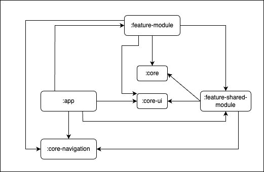

# Implementation documentation

In this code base, I implemented single activity, compose only, multi-module solution for sorting and searching restaurants. 
The above dependency graph is showing which module are depending on which module. Core modules are not depending on any other 
module. Any feature module can depend on feature-shared modules and core modules. The feature-shared module can depend on
core modules. App module can depend on every other modules. The modularization is done depending on vertical slicing approach. 
For more information please check [this article](https://jeroenmols.com/blog/2019/03/18/modularizationarchitecture/).

## Architecture
To implement the solution, I used MVI+MVVM architecture with clean architecture
approach in each module. In MVI (Model, View, Intent) architecture user interaction regard as event (or user intent)
that change the model which represents UI state. ViewModel is responsible for creating immutable state
for the ui. I use shared flow for user events, compose state for states and channel for effect
(means side effect of any exception). User events and effects are one time event that is why I use
hot observable like shared flow and channel. Shared flow can be observed from multiple subscribers for this reason
it is a better option to use it for users event (if we want multiple work starting with one event). However,
channel is better choice for effects because it can only have single subscriber and absence of the subscriber it will
suspend till the channel buffer becomes full, waiting for a subscriber to appear. For more information please check
[this article](https://elizarov.medium.com/shared-flows-broadcast-channels-899b675e805c). Channel is also used for
navigation event which is handled by main activity.

Inside every feature module, the packages representing clean code architecture layers (presentation, domain, data). 
The presentation layer is responsible for drawing UI, UI related logic and holding UI states. Composable screens, view model,  
UI data models and mappers are part of the presentation layer. Domain layer is responsible for business logic. Different business
use cases and domain models are implemented in this layer. Data layer is responsible for providing data. Repository 
implementation, datasource (internal and external) should be part of data layer. 

The shared code with other feature modules are placed in the feature-shared module. Any feature module can depend on 0 to n number 
feature shared module to get similar behavior like other features. Core modules are pure library modules which are used by other modules.
They cannot depend on any other feature or feature-shared module. 